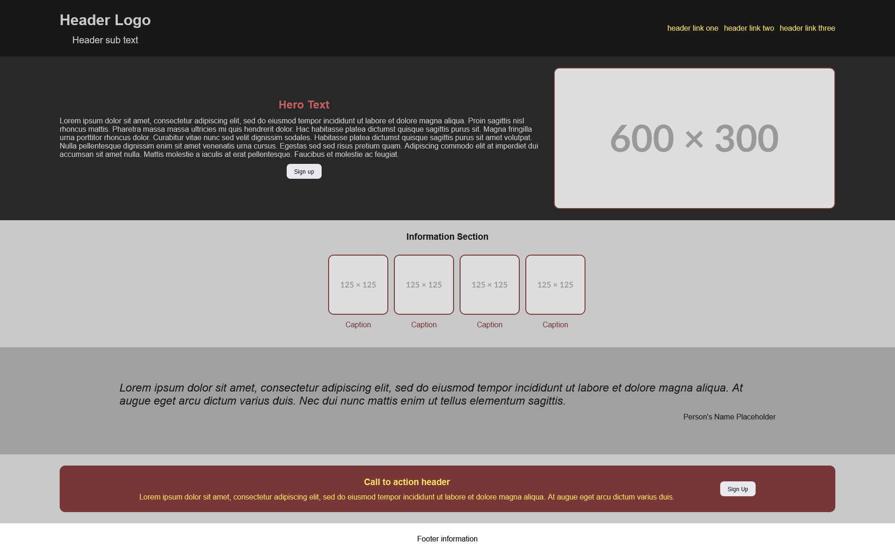

# odin-landing-page
The Odin Project - Foundations Course - Landing Page Project

This project was created while following along with [this lesson](https://www.theodinproject.com/lessons/foundations-landing-page) on The Odin Project.

# Purpose

The main purpose of this project is to demonstrate knowledge in CSS and HTML gained in the [HTML Foundations](https://www.theodinproject.com/paths/foundations/courses/foundations#html-foundations) and [CSS Founations](https://www.theodinproject.com/paths/foundations/courses/foundations#css-foundations) courses of the Odin Project. It also provided a chance to explore and combine the concepts in different ways than what was seen in the exercises.

# Requirements

Create a landing page in HTML and CSS that resembles a design provided by the course assignment.

# Implementation

The project did not require responsive design elements, but I added some in so that I can use it as a baseline to compare with in the future.

## Live Preview

[Preview](https://dczemina.github.io/odin-landing-page/)

## Screenshot

